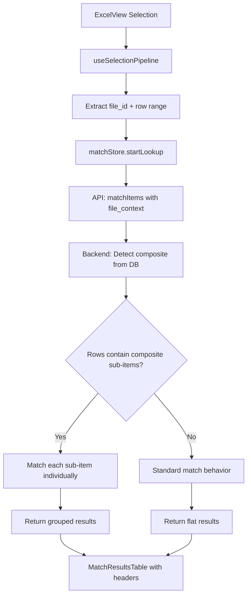

# Composite Unit Matching - Implementation Plan

## Overview

This plan details the implementation of composite unit detection and per-sub-item matching in the BoQ matcher system. When users select rows in Excel containing a composite unit (parent description + sub-items a, b, c, d), the system should detect this structure and match each sub-item individually.

## Problem Statement

Currently, when users select multiple rows in the Excel view:

1. All descriptions are concatenated with newlines
2. The combined text is sent to the RAG matcher as a single query
3. Results are returned as a flat list

This approach fails for composite units because:
- RAG searches on concatenated text that doesn't match indexed structure
- Composite units (parent + sub-items) aren't matched as a group
- Individual sub-item prices aren't available for comparison

## Architecture

### Data Flow



### Key Files to Modify

| Layer | File | Changes |
|-------|------|---------|
| Backend Schema | `app/schemas/boq.py` | Extend MatchRequest, add MatchGroup |
| Backend Router | `app/routers/items.py` | Add composite detection + per-sub-item matching |
| Frontend Types | `src/lib/types.ts` | Add MatchGroup, extend MatchResponse |
| Frontend API | `src/lib/api.ts` | Extend matchItems for file_context |
| Frontend Store | `src/stores/matchStore.ts` | Pass file_id + row range |
| Frontend Pipeline | `src/hooks/useSelectionPipeline.ts` | Extract file_id + start/end row |
| Frontend Table | `src/components/boq/MatchResultsTable.tsx` | Render grouped results |

## Implementation Steps

### Phase 1: Backend Schema Extensions

#### 1.1 Extend MatchRequest

```python
# app/schemas/boq.py

class MatchRequest(BaseModel):
    description: str
    quantity: float | None = None
    unit: str | None = None
    item_number: str | None = None
    threshold: float = 0.3
    max_results: int = 20
    # NEW: File context for composite detection
    file_id: str | None = None
    start_row: int | None = None
    end_row: int | None = None
```

#### 1.2 Add MatchGroup Schema

```python
class MatchGroup(BaseModel):
    """Group of matches for a single sub-item within a composite unit"""
    sub_item_description: str
    parent_item_number: str | None = None
    matches: list[MatchResult]

class MatchResponse(BaseModel):
    matches: list[MatchResult]
    stats: dict
    # NEW: Grouped results for composite units
    groups: list[MatchGroup] | None = None
    is_composite: bool = False
```

### Phase 2: Backend Match Endpoint Logic

#### 2.1 Composite Detection

In `app/routers/items.py`, modify `match_items`:

```python
@router.post("/match", response_model=MatchResponse)
def match_items(req: MatchRequest, db: Session = Depends(get_db)):
    # NEW: Check for composite context
    if req.file_id and req.start_row is not None and req.end_row is not None:
        # Look up items from DB in the row range
        items_in_range = db.query(BoQItem).filter(
            BoQItem.file_id == req.file_id,
            BoQItem.row >= req.start_row,
            BoQItem.row <= req.end_row
        ).all()
        
        # Detect composite: items with same parent_item_number (composite_sub type)
        composite_items = [i for i in items_in_range if i.item_type == "composite_sub"]
        
        if composite_items:
            # Group by parent_item_number
            by_parent: dict[str, list[BoQItem]] = {}
            for item in composite_items:
                parent = item.parent_item_number
                if parent:
                    by_parent.setdefault(parent, []).append(item)
            
            # Process each parent group
            groups: list[MatchGroup] = []
            for parent_num, sub_items in by_parent.items():
                group_matches: list[MatchResult] = []
                for sub_item in sub_items:
                    # Run RAG search on sub-item's full_description
                    hits = rag_search(
                        query_text=sub_item.full_description or sub_item.description,
                        top_k=req.max_results,
                    )
                    # ... build MatchResult for each hit (same logic as current)
                    group_matches.extend(process_hits(hits, req, db))
                
                groups.append(MatchGroup(
                    sub_item_description=f"Pod-stavke za {parent_num}",
                    parent_item_number=parent_num,
                    matches=group_matches,
                ))
            
            return MatchResponse(
                matches=[],  # Flat list empty for composite
                stats=compute_stats(groups),
                groups=groups,
                is_composite=True,
            )
    
    # Standard (non-composite) path - existing logic
    # ... (lines 43-169 from current implementation)
```

#### 2.2 Row Number Handling

Note: Univer uses 0-based row indices, while openpyxl uses 1-based. Add offset handling:

```python
# In items.py
UNIVER_TO_OPENPYXL_OFFSET = 1  # Add 1 to convert Univer -> DB row

# When querying:
start_row = (req.start_row or 0) + UNIVER_TO_OPENPYXL_OFFSET
end_row = (req.end_row or 0) + UNIVER_TO_OPENPYXL_OFFSET
```

### Phase 3: Frontend Types

#### 3.1 Extend TypeScript Types

```typescript
// src/lib/types.ts

export interface MatchGroup {
  sub_item_description: string;
  parent_item_number: string | null;
  matches: MatchResult[];
}

export interface MatchResponse {
  matches: MatchResult[];
  stats: MatchStats;
  groups?: MatchGroup[];       // NEW: For composite units
  is_composite?: boolean;     // NEW: Flag for composite mode
}
```

### Phase 4: Frontend API

#### 4.1 Extend matchItems Function

```typescript
// src/lib/api.ts

interface MatchRequestWithContext {
  description: string;
  quantity?: number;
  threshold?: number;
  max_results?: number;
  // NEW: File context
  file_id?: string;
  start_row?: number;
  end_row?: number;
}

export async function matchItems(
  description: string,
  quantity?: number,
  threshold?: number,
  fileContext?: { file_id: string; start_row: number; end_row: number }
): Promise<MatchResponse> {
  return fetchAPI<MatchResponse>("/api/match", {
    method: "POST",
    body: JSON.stringify({
      description,
      ...(quantity !== undefined && { quantity }),
      ...(threshold !== undefined && { threshold }),
      // NEW: Include file context
      ...(fileContext && {
        file_id: fileContext.file_id,
        start_row: fileContext.start_row,
        end_row: fileContext.end_row,
      }),
    }),
  });
}
```

### Phase 5: Frontend Selection Tracking

#### 5.1 Add file_id to BoQSelection

```typescript
// src/stores/selectionStore.ts

export interface BoQSelection {
  id: string;
  startIndex: number;    // Univer 0-based row index
  endIndex: number;     // Univer 0-based row index
  items: BoQItem[];
  color: SelectionColor;
  file_id?: string;     // NEW: Track which file this selection belongs to
}
```

#### 5.2 Update addSelection

```typescript
addSelection: (startIndex: number, endIndex: number, items: BoQItem[], fileId: string) => {
  // ... existing logic
  selection.file_id = fileId;  // Store file_id
}
```

### Phase 6: Selection Pipeline

#### 6.1 Extract file_id and row range

```typescript
// src/hooks/useSelectionPipeline.ts

// Inside the effect, when processing a new selection:
const file_id = selection.items[0]?.file_id;
const start_row = selection.startIndex;  // Univer 0-based
const end_row = selection.endIndex;

// Pass to match lookup
if (file_id !== undefined) {
  useMatchStore.getState().startLookup(
    selection.id,
    combinedDesc,
    qty,
    { file_id, start_row, end_row }  // NEW: file context
  );
} else {
  // Fallback: legacy behavior without file context
  useMatchStore.getState().startLookup(selection.id, combinedDesc, qty);
}
```

### Phase 7: Match Store

#### 7.1 Extend startLookup signature

```typescript
// src/stores/matchStore.ts

interface MatchState {
  startLookup: (
    selectionId: string,
    description: string,
    quantity?: number,
    fileContext?: { file_id: string; start_row: number; end_row: number }
  ) => Promise<void>;
  // ... existing
}

// Implementation
startLookup: async (selectionId, description, quantity, fileContext) => {
  // ... existing setup
  const response = await api.matchItems(
    description,
    quantity,
    undefined,  // threshold uses default
    fileContext  // NEW: pass file context
  );
  // ... existing response handling
}
```

### Phase 8: Match Results Display

#### 8.1 Handle grouped results in MatchResultsTable

```typescript
// src/components/boq/MatchResultsTable.tsx

// Inside the component:
const { matches, groups, is_composite } = results;

// If composite with groups, render grouped display
if (is_composite && groups && groups.length > 0) {
  return (
    <div className="composite-results">
      {groups.map((group, groupIdx) => (
        <div key={groupIdx} className="match-group">
          <div className="group-header">
            <h4>{group.parent_item_number}</h4>
            <span className="group-label">{group.sub_item_description}</span>
          </div>
          <table>
            <thead>...</thead>
            <tbody>
              {group.matches.map((match, matchIdx) => (
                <MatchRow key={matchIdx} match={match} />
              ))}
            </tbody>
          </table>
        </div>
      ))}
    </div>
  );
}

// Otherwise, render flat list (existing behavior)
return (
  <table>
    <tbody>
      {matches.map((match, idx) => (
        <MatchRow key={idx} match={match} />
      ))}
    </tbody>
  </table>
);
```

#### 8.2 Add CSS for grouped results

```css
/* Add to spreadsheet.css or MatchResultsTable.css */

.match-group {
  margin-bottom: 16px;
  border: 1px solid #e5e7eb;
  border-radius: 6px;
  overflow: hidden;
}

.match-group .group-header {
  background: #f3f4f6;
  padding: 8px 12px;
  border-bottom: 1px solid #e5e7eb;
}

.match-group .group-header h4 {
  margin: 0;
  font-size: 14px;
  font-weight: 600;
}

.match-group .group-label {
  font-size: 12px;
  color: #6b7280;
}
```

## Data Models Reference

### BoQItem (Database)

| Field | Type | Description |
|-------|------|-------------|
| id | UUID | Primary key |
| file_id | UUID | FK to BoQFile |
| row | int | Excel row number (1-based from openpyxl) |
| item_number | str | Item number (e.g., "1", "1.1") |
| description | str | Short description |
| full_description | str | Full description with parent context |
| parent_item_number | str | Parent item number if composite_sub |
| item_type | str | "simple", "composite_sub", "section_header", "ne_nudimo" |
| unit | str | Unit of measure |
| quantity | float | Quantity |
| unit_price | float | Unit price |
| total | float | Total price |

### BoQUnit (Database)

| Field | Type | Description |
|-------|------|-------------|
| id | UUID | Primary key |
| file_id | UUID | FK to BoQFile |
| parent_item_number | str | Parent item number |
| parent_description | str | Full parent description |
| parent_title | str | Short parent title |
| item_ids | JSON | Array of child BoQItem IDs |
| start_row | int | First row of composite unit |
| end_row | int | Last row of composite unit |
| subtotal | float | Sum of all sub-item totals |
| item_count | int | Number of sub-items |

## Edge Cases

1. **Mixed selection**: Selection contains both simple items and composite sub-items
   - Solution: Check if ANY items in range are composite_sub type

2. **Multiple composite units in one selection**
   - Solution: Group by parent_item_number, create one MatchGroup per parent

3. **Row index mismatch**: Univer 0-based vs openpyxl 1-based
   - Solution: Add offset constant, document clearly

4. **No file context provided**: Legacy API calls without file_id
   - Solution: Maintain backward compatibility, skip composite detection

5. **Empty composite group**: Composite detected but no RAG hits for sub-items
   - Solution: Return empty matches array for that group, still mark as composite

## Testing Strategy

1. **Unit Tests** (Backend):
   - Test composite detection logic with mock BoQItems
   - Test row range offset handling

2. **Integration Tests**:
   - Test complete flow: selection -> API -> grouped response

3. **Manual Testing**:
   - Select composite unit in Excel view
   - Verify grouped results with headers display correctly
   - Verify individual sub-item prices are shown

## Success Criteria

1. When selecting a composite unit (rows with same parent_item_number), results are grouped
2. Each sub-item shows individual price matches
3. Non-composite selections continue to work as before (backward compatible)
4. Frontend displays grouped results with clear visual separation
5. Row index mapping between Univer and database is correct
